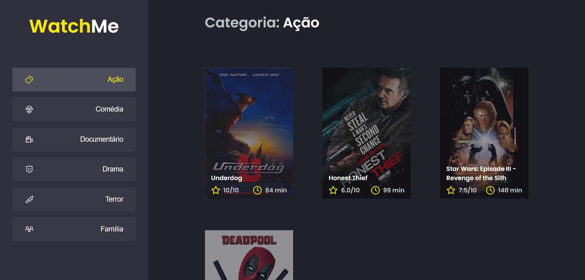

<h1 align="center"> Componentizando a aplicacao WatchMe</h1>

Nesse desafio a aplicação foi dividida em componentes afim de isolar as responsabilidades e facilitar a manutenção do código.

<h2>Fake API com JSON Server</h2>

Foi utilizado o JSON Server para simular uma API que possui as informações de gêneros e filmes que são usados na aplicação.

<h2>Utilizando a aplicação</h2>

- Clonando a aplicação:

<pre>
<code>
  git clone https://github.com/LuzianeFreitas/componentizando-aplicacao.git
</code>
</pre>

- Executando a Fake API

<pre>
<code>
  yarn
  yarn server
</code>
</pre>

- Executando a aplicação 

<pre>
<code>
  // Abra um segundo terminal e execute o comando abaixo
  
  yarn dev
</code>
</pre>

- Acessando a aplicação

<pre>
<code>
  // Abra o navegador e digite
  
  http://localhost:8080/
</code>
</pre>
